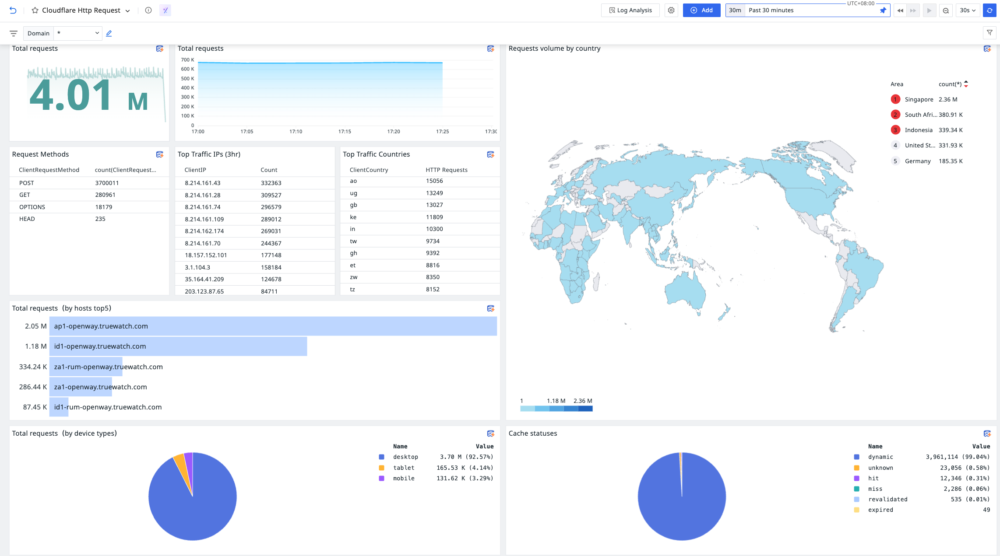
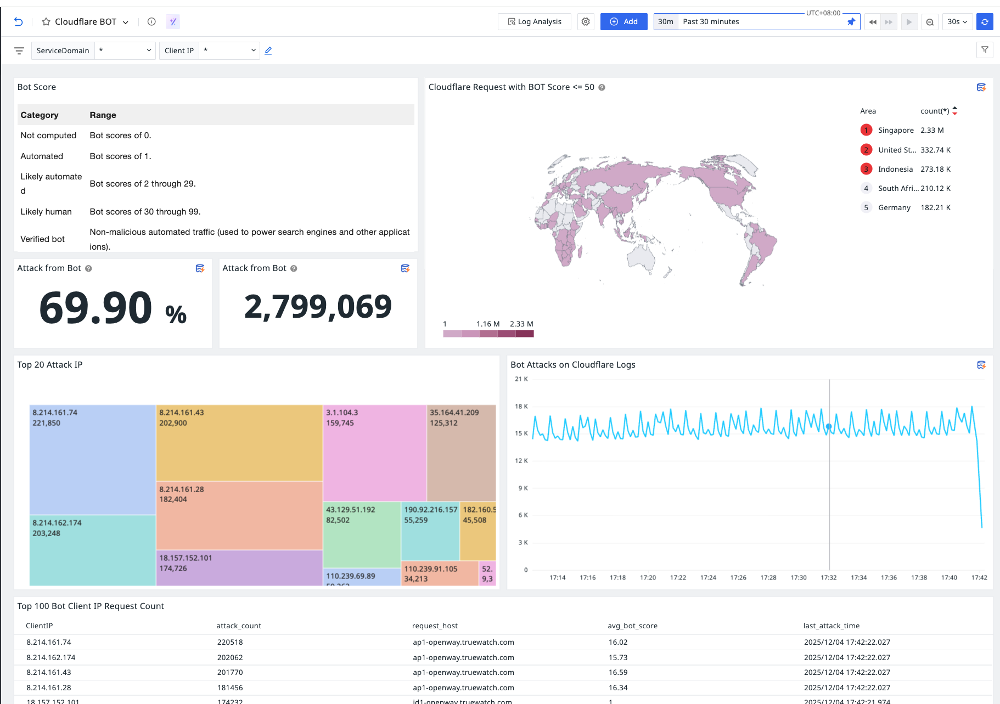
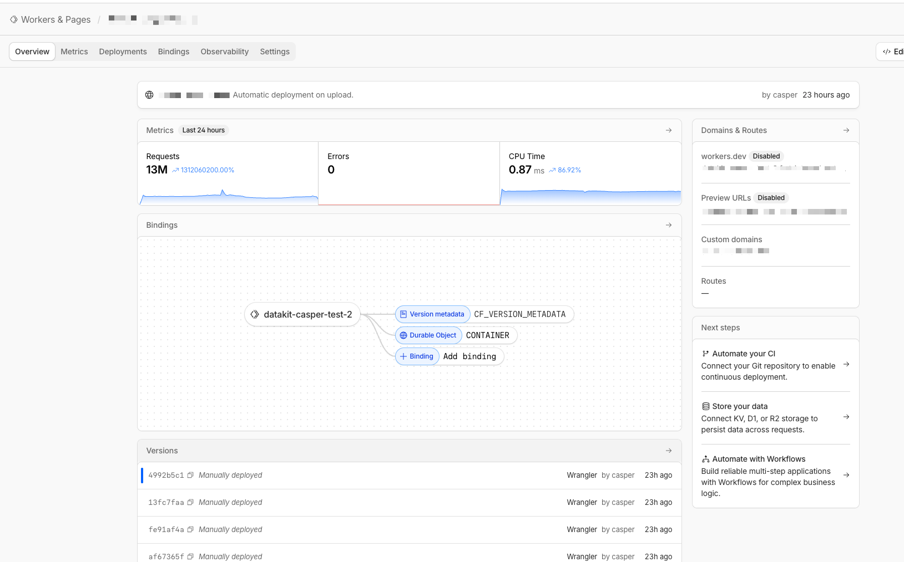

# Cloudflare Logpush to TrueWatch Integration

**Seamless HTTP Request Log Collection via Cloudflare Workers**

---

## Overview

This project enables **real-time HTTP request log streaming** from Cloudflare domains to the TrueWatch monitoring platform using Cloudflare Workers and Containers.

By leveraging Cloudflare's global edge network and serverless infrastructure, you can collect, process, and forward logs without managing traditional server infrastructure.



---

## Why Cloudflare Logpush to TrueWatch?

### ✅ Zero Infrastructure Management

- **Serverless Architecture**: No servers to provision, patch, or maintain
- **Auto-scaling**: Automatically handles traffic spikes without manual intervention
- **Global Edge Network**: Logs are collected at Cloudflare's edge, minimizing latency

### ✅ Real-time Log Streaming

- **Instant Delivery**: HTTP request logs are pushed in real-time to TrueWatch
- **Multiple Format Support**: Handles JSON, NDJSON, and compressed data automatically

### ✅ High Availability & Reliability

- **Load Balancing**: Automatic distribution across multiple container instances
- **Blue-Green Deployments**: Seamless version transitions with zero downtime
- **Auto-recovery**: Containers automatically restart on failures

### ✅ Cost Optimization

- **Auto-sleep**: Containers automatically stop after configurable idle periods
- **Pay-per-use**: Only pay for actual compute time used

---

## Security Analytics & Threat Visibility

Leverage Cloudflare's built-in security metrics to gain **real-time threat intelligence** directly in TrueWatch.

With Bot Score, attack patterns, and geographic data from Cloudflare logs, you can:

- 🔍 **Identify Bot Attacks**: Analyze bot scores to detect automated threats
- 🌍 **Geographic Threat Mapping**: Visualize attack origins by country/region
- 📈 **Real-time Attack Monitoring**: Track attack trends and patterns over time
- 🎯 **Top Attacker Analysis**: Identify and monitor the most active malicious IPs



---

## Architecture

```
Cloudflare Logpush  →  Worker  →  Container (DataKit)  →  TrueWatch Platform
```

The solution leverages Cloudflare's serverless infrastructure:



### Core Components

| Component | Function |
|-----------|----------|
| **Cloudflare Logpush** | Pushes HTTP request logs from your domains |
| **Cloudflare Worker** | Receives and routes log requests with load balancing |
| **Durable Objects** | Manages container lifecycle and request proxying |
| **Container (DataKit)** | Processes logs and forwards to TrueWatch |

---

## Key Features

| Feature | Description |
|---------|-------------|
| 🔄 **Elastic Scaling** | Automatic load balancing across container instances |
| ⏰ **Auto-Sleep** | Cost-saving idle timeout for containers |
| 🔀 **Blue-Green Deployment** | Zero-downtime version transitions |
| 📊 **Multi-Format Support** | JSON, NDJSON, gzip, deflate |
| 🌐 **Global Edge** | Low-latency collection worldwide |
| 🛡️ **Security Insights** | Bot detection & threat analytics |

---

## Benefits Summary

| Benefit | Traditional Setup | Cloudflare Workers |
|---------|------------------|-------------------|
| Infrastructure | Requires VM/Server | Fully serverless |
| Scaling | Manual configuration | Automatic |
| Availability | Single region | Global edge network |
| Maintenance | Regular patching | Zero maintenance |
| Cost Model | Fixed + variable | Pure pay-per-use |
| Deployment | Downtime required | Blue-green, zero downtime |

---

## Getting Started

For complete deployment instructions, configuration details, and troubleshooting:

📖 **[Setup Guide](./SETUP_GUIDE.md)** - Step-by-step deployment instructions

📐 **[Architecture](./ARCHITECTURE.md)** - Technical architecture details
